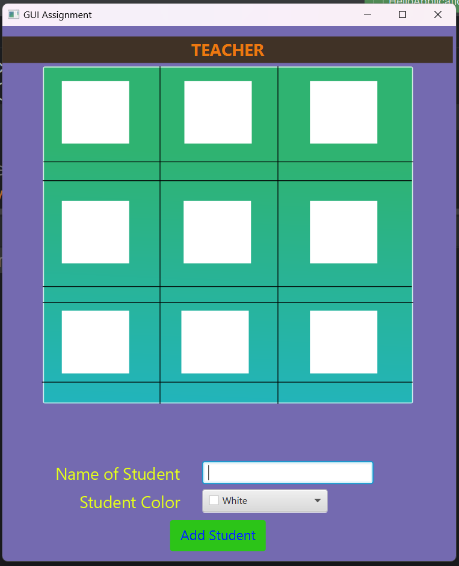
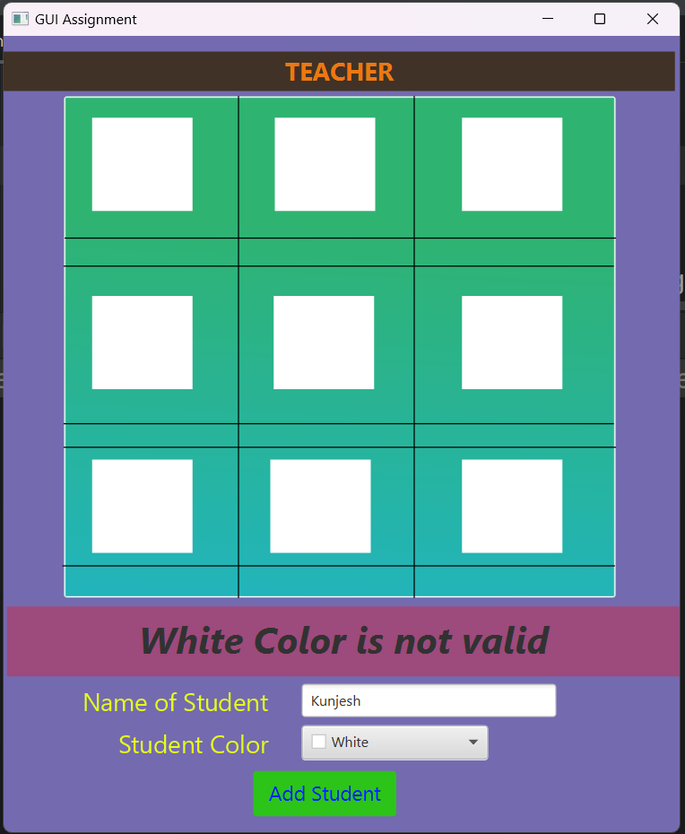
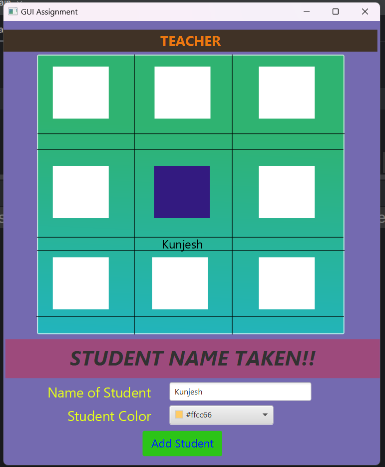
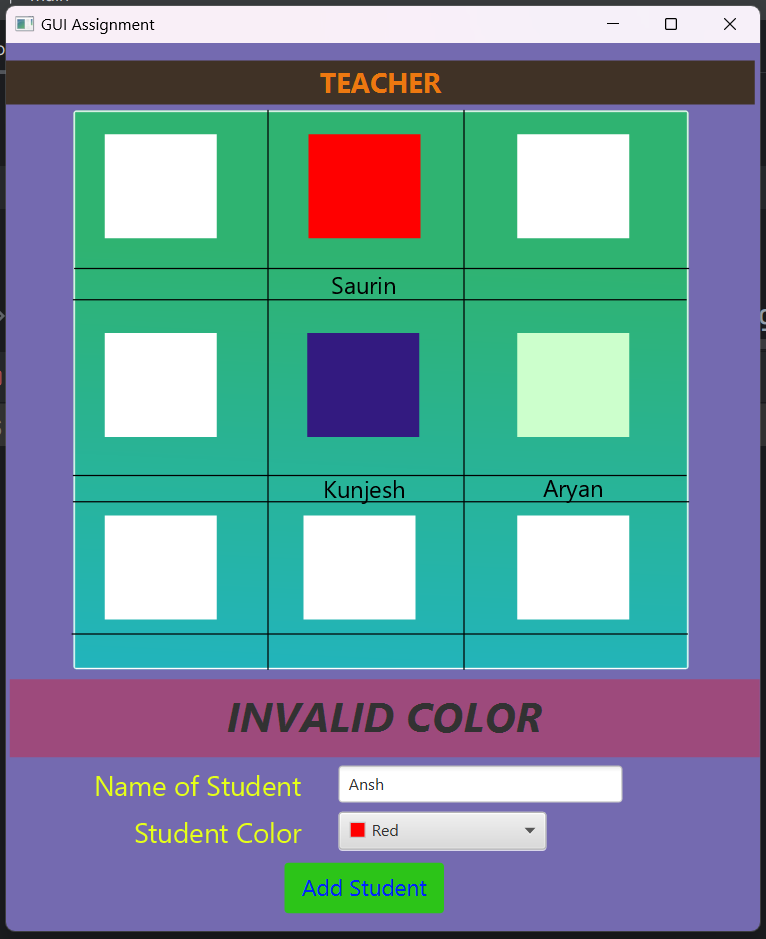
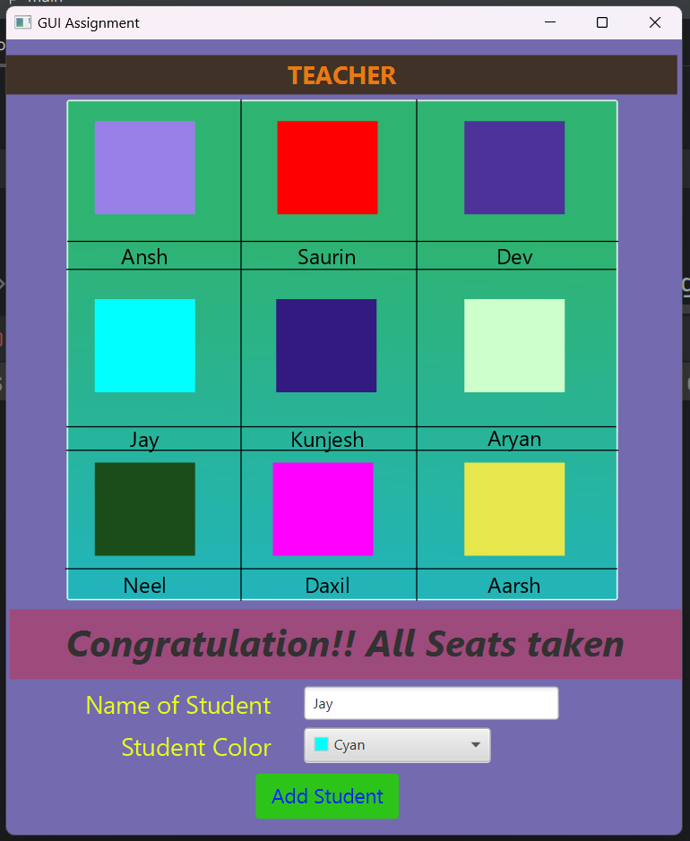
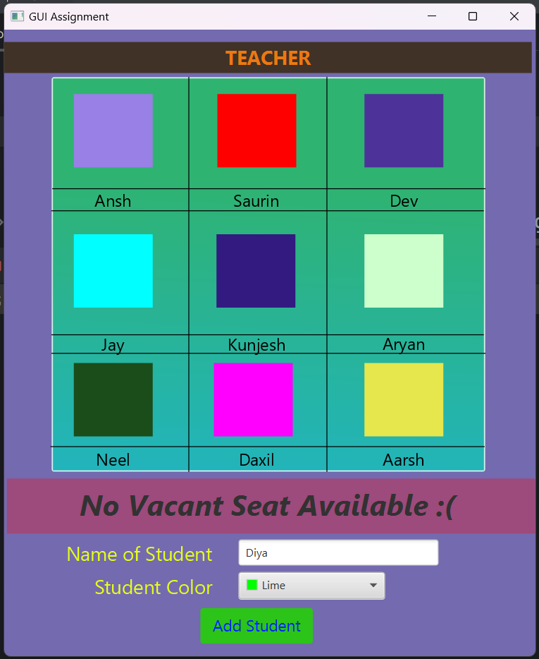

# **Student Seating Arrangement**

## **Introduction**

In this GUI, I have created sitting arrangement for 9 students.

There are rules on the basis of which student will get a random place out of 9 different places.

<blockquote>

<b>RULES</b>

1. White color is not valid.
2. Same name is not valid (case-sensitive).
3. Same color is not valid.
4. Same name and Same Color is not valid. [When you add same name and same color, it will give an error just like 2nd Rules. Why? Because we input name first then color, so name is checked first, and it will give error at that point]
5. Only 9 Entries.

</blockquote>

It's a working model.

You can clone & run this model in your PC, just make a connection of SceneBuilder with IntelliJ :1st_place_medal:

## **Programming Language and Technologies used**

- [x] Java
- [x] SceneBuilder
- [x] JetBrains IntelliJ
- [x] Git

## **Concepts Used**

> AnchorPane (Label, Rectangle, Line, Pane, Text, TextField, Button, ColorPicker)
>
> Some Formatting (color-gradient, font-size, height, width, alignment etc.)

## **Resources**

1. College Notes
2. Google

## **GUI Screenshots**

<h3><b>GUI initial Screen</b></h3>

 

 

<h3><b>White color error</b></h3>

 

 

<h3><b>Same name error</b></h3>

 

 

<h3><b>Same color error</b></h3>

 

 

<h3><b>9 Entries Maximum!</b></h3>

 

 

<h3><b>Trying to Enter 10th Entry</b></h3>

# 
**A Big Thank You!**

